# Tensorflow Implementation of Holographic Embeddings
Author: BH

## Holographic Embeddings [1]

Holographic Embeddings are an approach to generating entity embeddings from a list of (head, tail, relation) triples like ("Jeff", "Amazon", "employer") and ("Zuck", "Palo Alto", "location"). Embeddings can be used as lossy, but memory-efficient inputs to other machine learning models, used directly in triple inference (aka Knowledge Base Completion or Link Prediction) by evaluating candidate triples, or to search for associated entities using k-nearest neighbors.

For example, a search from the embedding representing the entity "University of California, Berkeley" yields the associated entities UC Irvine, Stanford University, USC, UCLA, and UCSD.

Often the exact association corresponding to the various dimensions of the embedding are ambiguous and not clearly defined, much like the learned neurons of a neural network. However, in this case, it appears the embedding has captured some information regarding University entities (the search could have yielded other Organizations, such as Macy's or IBM) as well as geographical locations (all of these are schools in California).

## Approach
Holographic Embeddings employ circular correlation, which provides a fast vector heuristic for evaluating pair-wise entity similarity. It is similar to a matrix multiplication in that every cross-term contributes to the final result, however the result is squashed into a vector, trading some resolution for both memory-efficiency and runtime performance -- each epoch roughly O(td * log(d)) where t is the number of triples and d is the embedding-dimension. In practice, d is sufficiently small that performance resembles O(n).

Loss is scored from a pairwise hinge-loss where negative scores are evaluated using a *type-safe corruption*. Each positive triple provided is *corrupt* such that one entry in (head, tail, relation) is randomly modified. For example, ("Jeff", "Amazon", "employer") may yield corrupt triples like ("Jeff", "Facebook", "employer"), ("Nancy", "Amazon", "employer"), or ("Jeff", "Amazon", "location"). Corruption is type-safe, such that corruption will not generate triples like ("Jeff", "Palo Alto", "employer") because the city of Palo Alto is not a valid employer entity.

For more information, view this [presentation](https://docs.google.com/presentation/d/1fCfKGmkGyTmHqBWR2oGnS_muGvtZ_a1fb32lL_B5v3Q/edit?usp=sharing).

## Tensorboard Graph

### Evaluation and Loss

In HolE, Evaluation is scored `E(h,t,r) = sigmoid(multiply(r, circularCorrelation(h, t)))` where `circularCorrelation(h, t) = ifft(multiply(conjugate(fft(h)), fft(t)))`. It is important to note that circular correlation is not a symmetric function and that `circularCorrelation(h, t) != circCorrelation(t, h)`, allowing the model to observe directional relations, such as "employer" and "employee".

Loss is computed from a pair-wise hinge-loss against the generated corrupt triple. Given a positive triple `T`, we generate a corrupt triple `C`. If efficient, we could check whether `C` is among the valid triples, but this is currently ignored. Then the final training Loss is defined `L(T) = max(E(T) - E(C) + MARGIN, 0)`. In practice, margin is 0.2, borrowing the parameters defined in Maximilian Nickel's open source [scikit-kge](https://github.com/mnick/scikit-kge). It may be feasible to grow the margin as a function of time and maintain the best scoring model against the validation set.

### Model Architecture

At initialization, embeddings are randomly generated for each entity and each relation in the input triple file, which consists entirely of positive triples. Two in-memory tables are generated for the purpose of generating corrupt triples: a mapping of indexes to their entity type and a mapping from type to an array entity indexes. To alleviate GPU memory pressure, the type to index map is subsampled for each batch -- this is likely a source of much data shuffling between GPU and CPU and there is certainly room for improvement.

For each epoch, we train batches using the loss described above using stochastic gradient descent. We occasionally evaluate the current model against a hold out validation set. Unfortunately this score is very noisy due to the randomly generated corrupt triples. It is typical for the model to observe no progresss for some time before rapidly converging.

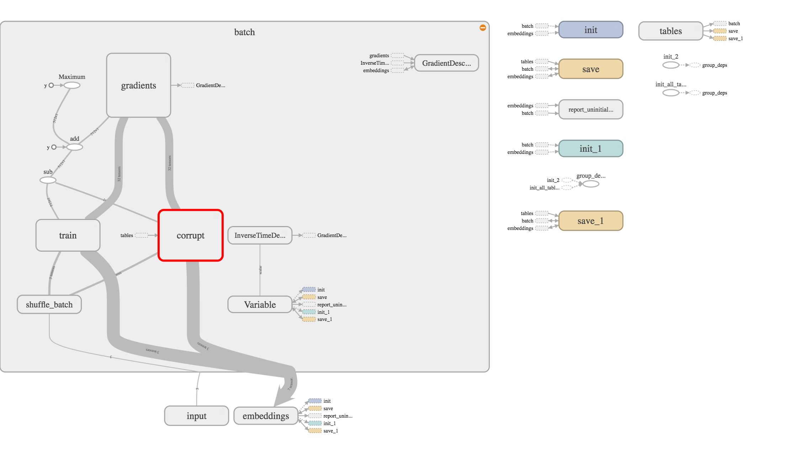

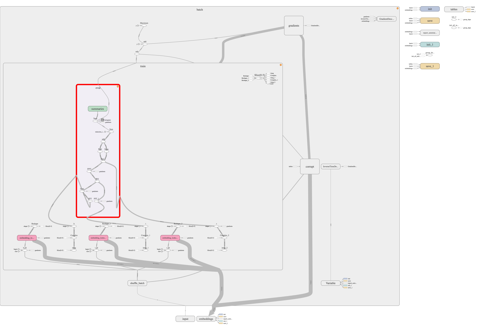

See holE.py for implementation details.

## Tensorboard Demo: Search Associated Entities

Tensordboard offers a fantastic embedding visualization tool, applying T-SNE or PCA in the browser on the first 100k embeddings. Here are few snippets of the UI and some example queries using Holographic Embeddings. This experiment began 2017-08-24 and ran over 3 days on 16GB RAM and a single GPU from 2014 on 1.2 million entities and 30 million triples.

The unit ball with all available (first 100k limited by Tensorboard) entities, colored by type.

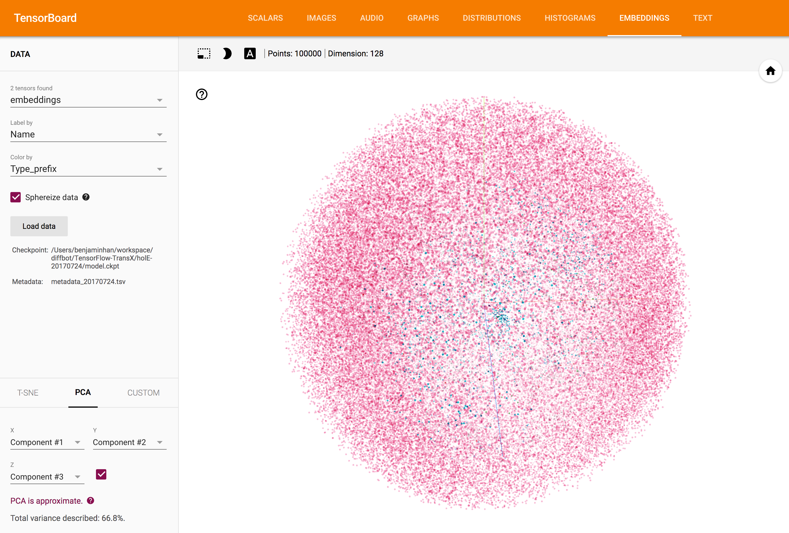

### Skills

A search from the embedding representing the skill, "Programming Languages", yields nearest neighbors java programming, sql, computer programming, c, mysql, javascript, c++, c#, xml, python programming

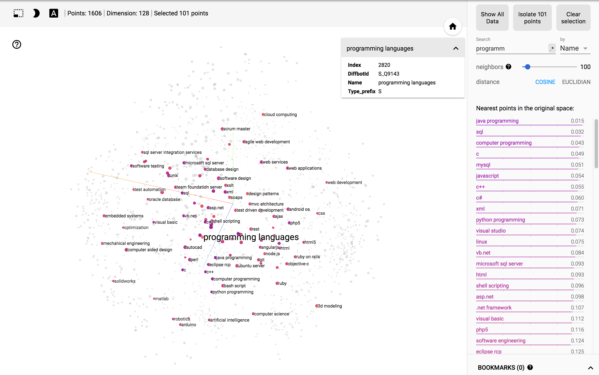

Skill "physics" yields simulations, solidworks (CAD software often used by engineers/researchers), matlab, robotics, labview, fortran, optical, pspice (circuit simulation software), signal processing, fluid mechanics

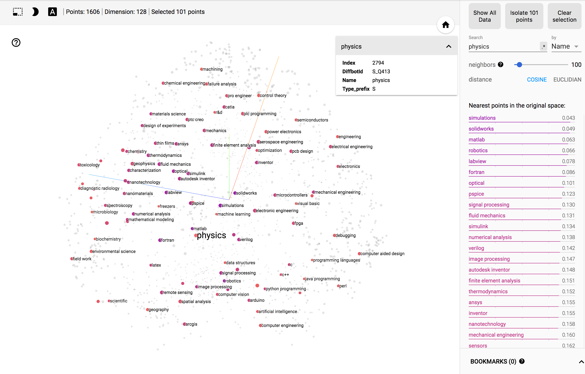

Skill "sales" yields marketing, supply chain management, marketing strategy, new business development, key account, business development, retail, business strategy

### Locations

Location "Palo Alto" yields Mountain View, San Jose, Sunnyvale, Berkeley, Santa Clara, Quito, Manila, Oakland. Note that these are mostly close in proximity (except some odd results in Quito and Manila), but also close with regards to Organizations and populations. Berkeley is home to the closest undergraduate research university. These regions also have a high proportion of technology companies and startups. All results are also cities (and not neighborhoods, counties, or countries).

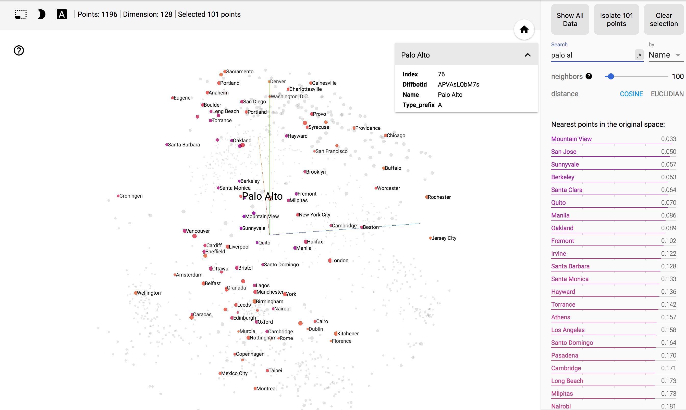

Location "Fairfax County" yields other counties in the United States. Why these counties is unclear to the author.

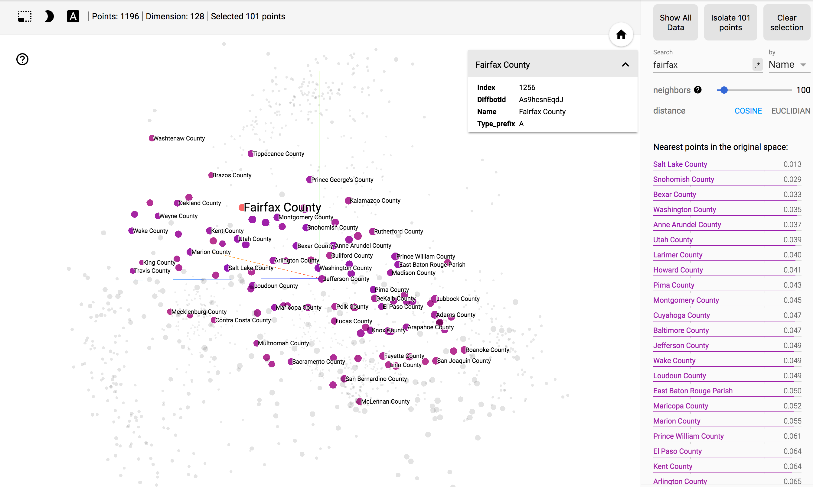

Location "Indonesia" yields People's Republic of China, Malaysia, Egypt, Turkey, Switzerland.

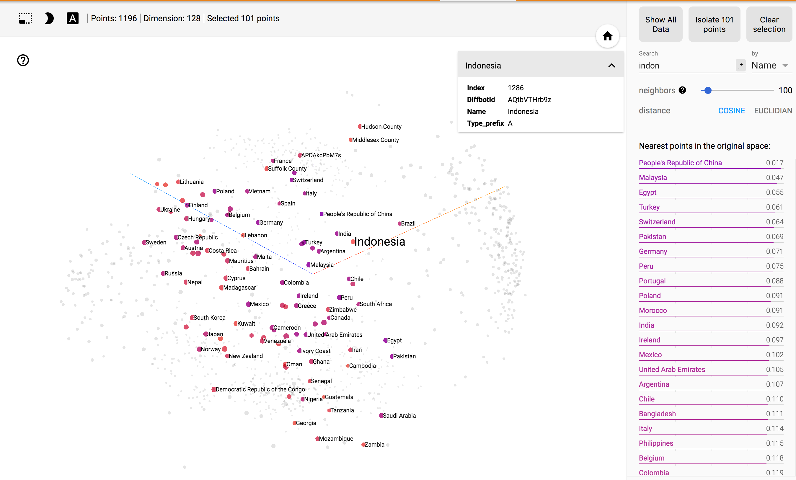

### Others

Organization "US Navy" yields United States Air Force, US Army, United States Army, Marine Corps Recruiting, Boeing. Boeing, while not a direct member of the US Defense, provides much of the aircraft for the military and is one of the largest defense contractors in the world. 

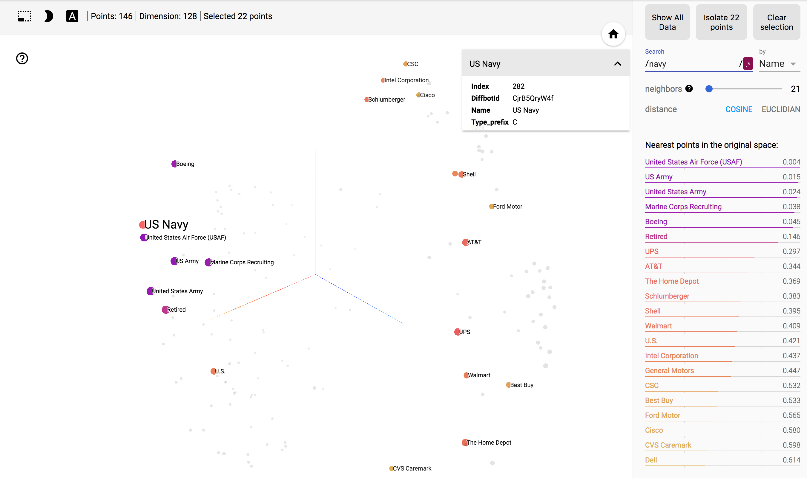

T-SNE on ages yields a curve that orders all of the ages sequentially.

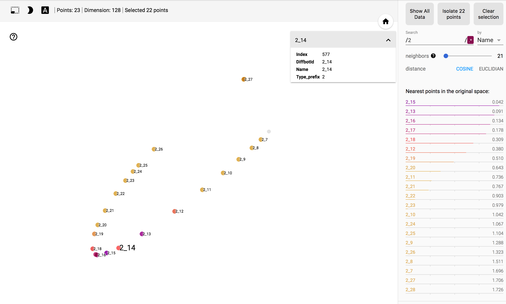

PCA on age embeddings yields a similar curve, however one axis appears to correlate with the working population. Embedding names represent the type (2 for age) and the 3-year bucket, for example bucket 2_6 contains ages in [18,21) while bucket 2_10 contains ages [30,33). The below image indicates ages below 21 and above 66 off the plane shared by age buckets for [22, 66). It is noteworthy that this structure is entirely learned from triples with relations like, skill, location, employer, and school.

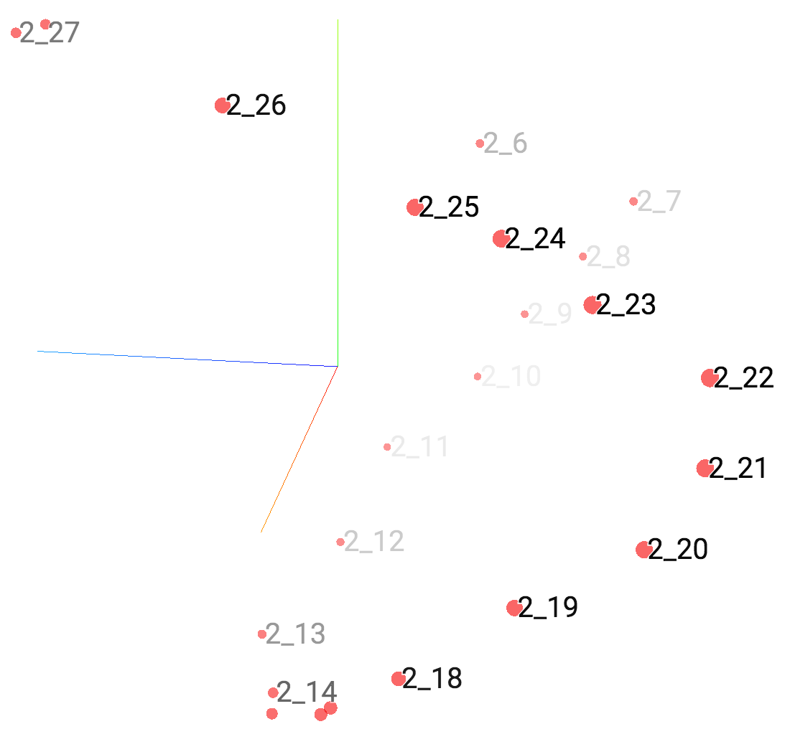

## Experiments

- Complex Embeddings: Circular correlation is evaluated using FFT, mapping real-valued entity embeddings into complex-space, before using an riFFT mapping them back into real-vectors. A natural extension would be to allow a D dimensional embedding to be mapped into a (D/2) dimension complex embedding, possibly encapsulating some phase information. While experimental results appeared satisfactory, [2] and [3] indicate an existing equivalence and that such memory use is better spent increasing the embedding dimension, D, itself.

- Global Bias: A major source of inference noise was frequency of obscure skills like Western Blotting or Groovy (programming language) over more common or more general skills like Molecular Biology and Java (programming language). A brief experiment using global biases attempted to provide an additional dimension with small-weight that would be added to the final triple evaluation. The intent was that common, general entities, like United States of America or Molecular Biology would have a large positive bias, while obscure entities like unknown persons and Western Blotting may have a negative bias. This resulted in severe overfitting to the detriment of both training time and mean reciprocal rank (MRR) in test.

## Scaling

Before moving to Holographic Embeddings in Tensorflow, most experiments were done in PTransE [4] using Java. While results were promising, PTransE required expensive graph traversals, similar to a 2-depth BFS starting from every node in the graph. However, many nodes are well-connected and this shallow query could yield almost the entire input graph and was infeasible for larger datasets. 

HolE runs in roughly O(EN) where N is the number of triples and E the number of epochs before convergence. Growth in E with respect to N is unclear, however Holographic Embeddings typically converges on 10 million entities with 250 million triples within 8 hours on a 4-GPU (Tesla P100) server with 32 GB RAM. Computation is mostly memory intensive due to negative triple corruption, which samples large arrays of indexes. This is expecially expensive for sampling Person type entities, which dominate the set of entities (>99% of entities are of type Person).

## Future

While convergence time is not an issue, and optimistically won't be for billions of entities and potentially trillions of triples, filtering candidates remains an obstacle. It is not clear which candidates provide meaningful results -- often persons claim expertise in soft skill such as leadership or management, but these are not valuable bits of information, nor can they be objectively evaluated. This task is still a work in progress at this time (2017-9-3).

## Reference

[1] Maximilian Nickel, Lorenzo Rosasco, Tomaso Poggio. (2016). Holographic Embeddings of Knowledge Graphs. AAAI 2016.

[2] Hayashi, Katsuhiko & Shimbo, Masashi. (2017). On the Equivalence of Holographic and Complex Embeddings for Link Prediction

[3] Trouillon, Théo & Nickel, Maximilian. (2017). Complex and Holographic Embeddings of Knowledge Graphs: A Comparison. 
