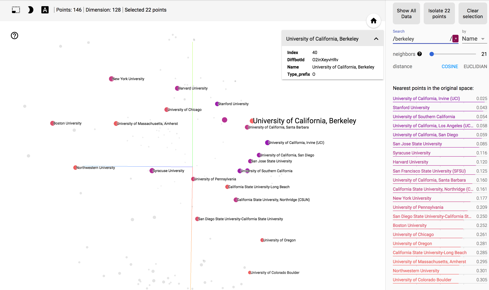

# Tensorflow Implementation of Holographic Embeddings
Author: BH

## Holographic Embeddings [1]

Holographic Embeddings are an approach to generating entity embeddings from a list of (head, tail, relation) triples like ("Jeff", "Amazon", "employer") and ("Zuck", "Palo Alto", "location"). Embeddings can be used as lossy, but memory-efficient inputs to other machine learning models, used directly in triple inference (aka Knowledge Base Completion or Link Prediction) by evaluating candidate triples, or to search for associated entities using k-nearest neighbors.

## Approach
Holographic Embeddings employ circular correlation, which provides a fast vector heuristic for evaluating pair-wise entity similarity. It is similar to a matrix multiplication in that every cross-term contributes to the final result, however the result is squashed into a vector, trading some resolution for both memory-efficiency and runtime performance -- each epoch roughly O(td * log(d)) where t is the number of triples and d is the embedding-dimension. In practice, d is sufficiently small that performance resembles O(n).

Loss is scored from a pairwise hinge-loss where negative scores are evaluated using a *type-safe corruption*. Each positive triple provided is *corrupt* such that one entry in (head, tail, relation) is randomly modified. For example, ("Jeff", "Amazon", "employer") may yeild corrupt triples like ("Jeff", "Facebook", "employer"), ("Nancy", "Amazon", "employer"), or ("Jeff", "Amazon", "location"). Corruption is type-safe, such that corruption will not generate triples like ("Jeff", "Palo Alto", "employer") because the city of Palo Alto is not a valid employer entity.

Embeddings can used as inputs to other machine learning models or directly used to infer by scoring candidate triples. This implementation observes type-safety in both corrupt triple generation and in inference.

## Tensorboard Demo: Search Associated Entities

## Experiments

- Complex Embeddings: Circular correlation is evaluated using FFT, mapping real-valued entity embeddings into complex-space, before using an iFFT mapping them back into real-vectors. A natural extension would be to allow a D dimensional embedding to be mapped into a (D/2) dimension complex embedding, possibly encapsulating some phase information. While experimental results appeared satisfactory, [2] and [3] indicate an existing equivalence and that such memory use is better spent increasing the embedding dimension, D, itself.

- Global Bias: A major source of inference noise was frequency of obscure skills like Western Blotting or Groovy (programming language) over more common or more general skills like Molecular Biology and Java (programming language). A brief experiment using global biases attempted to provide an additional dimension with small-weight that would be added to the final triple evaluation. The intent was that common, general entities, like United States of America or Molecular Biology would have a large positive bias, while obscure entities like unknown persons and Western Blotting may have a negative bias. This resulted in severe overfitting to the detriment of both training time and mean reciprocal rank (MRR) in test.

## Reference

[1] Maximilian Nickel, Lorenzo Rosasco, Tomaso Poggio. (2016). Holographic Embeddings of Knowledge Graphs. AAAI 2016.

[2] Hayashi, Katsuhiko & Shimbo, Masashi. (2017). On the Equivalence of Holographic and Complex Embeddings for Link Prediction

[3] Trouillon, Théo & Nickel, Maximilian. (2017). Complex and Holographic Embeddings of Knowledge Graphs: A Comparison. 
